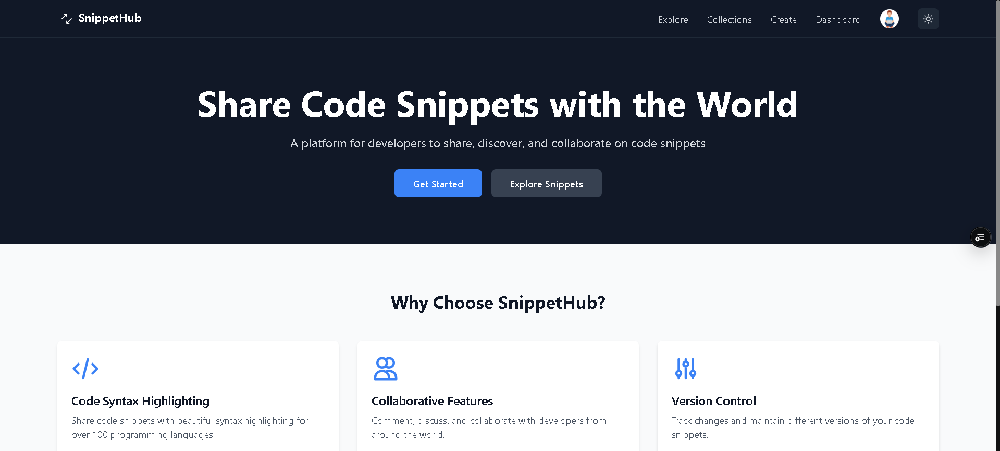
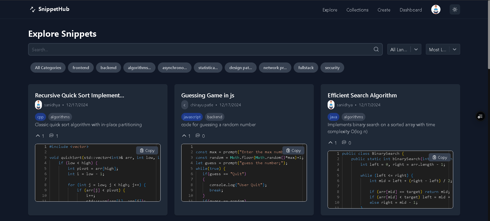

# SnippetHub 🚀

A modern, full-stack code snippet sharing platform where developers can create, share, discover, and manage code snippets across multiple programming languages.

## 📸 Screenshots

### Main Dashboard


### Explore Snippets


## ✨ Features

- **Code Snippet Management**: Create, edit, and organize code snippets with syntax highlighting
- **Multi-language Support**: Support for JavaScript, Python, Java, and many more programming languages
- **Collections**: Organize snippets into collections for better management
- **User Profiles**: Personal profiles with follower system and activity tracking
- **Voting System**: Upvote and downvote snippets based on quality and usefulness
- **Comments**: Engage with the community through snippet comments
- **Search & Discovery**: Advanced search functionality with filters by language, category, and tags
- **Categories & Tags**: Organize and filter content using categories and tags
- **Dark/Light Theme**: Modern UI with theme switching capability
- **Authentication**: Secure user registration and login system
- **AI Integration**: AI-powered features using Groq API
- **Code Execution**: Execute code snippets directly in the browser
- **Responsive Design**: Mobile-friendly interface built with Tailwind CSS

## 🛠️ Tech Stack

### Backend
- **Node.js** - Server runtime
- **Express.js** - Web application framework
- **MongoDB** - Database with Mongoose ODM
- **JWT** - Authentication and authorization
- **Cloudinary** - Media storage and management
- **Groq SDK** - AI integration
- **Multer** - File upload handling
- **bcryptjs** - Password hashing

### Frontend
- **React 18** - UI library
- **Vite** - Build tool and dev server
- **Tailwind CSS** - Utility-first CSS framework
- **React Router** - Client-side routing
- **Monaco Editor** - Code editor component
- **React Query** - Data fetching and caching
- **Framer Motion** - Animation library
- **React Hot Toast** - Notification system
- **Zustand** - State management
- **Next Themes** - Theme management

## 📋 Prerequisites

Before you begin, ensure you have the following installed:
- **Node.js** (v16 or higher)
- **npm** (v7 or higher)
- **MongoDB** (local installation or MongoDB Atlas)
- **Git**

## 🚀 Quick Start

### 1. Clone the Repository

```bash
git clone https://github.com/soniSanidhya/SnippetHub.git
cd SnippetHub
```

### 2. Backend Setup

```bash
# Navigate to backend directory
cd Backend

# Install dependencies
npm install

# Create environment file
cp .env.example .env
```

### 3. Configure Environment Variables

Create a `.env` file in the `Backend` directory with the following variables:

```env
# Server Configuration
PORT=3000

# Database
MONGODB_URI=mongodb://localhost:27017/snippethub

# JWT Secrets
ACCESS_TOKEN_SECRET=your-access-token-secret-here
REFRESH_TOKEN_SECRET=your-refresh-token-secret-here
ACCESS_TOKEN_EXPIRY=1d
REFRESH_TOKEN_EXPIRY=10d

# Cloudinary (for file uploads)
CLOUD_NAME=your-cloudinary-cloud-name
API_KEY=your-cloudinary-api-key
API_SECRET_KEY=your-cloudinary-api-secret

# AI Integration (Groq)
GROQ_API_KEY=your-groq-api-key

# Code Execution (Judge0 API)
RAPID_API_KEY_JUDGE0=your-judge0-api-key
```

### 4. Start the Backend Server

```bash
# Development mode with auto-reload
npm run dev

# Or production mode
npm start
```

The backend server will start on `http://localhost:3000`

### 5. Frontend Setup

Open a new terminal and navigate to the frontend directory:

```bash
# Navigate to frontend directory
cd Frontend

# Install dependencies
npm install

# Start the development server
npm run dev
```

The frontend application will start on `http://localhost:5173`

## 📝 Environment Variables Details

### Required Environment Variables

| Variable | Description | Example |
|----------|-------------|---------|
| `MONGODB_URI` | MongoDB connection string | `mongodb://localhost:27017/snippethub` |
| `ACCESS_TOKEN_SECRET` | JWT access token secret | `your-secret-key` |
| `REFRESH_TOKEN_SECRET` | JWT refresh token secret | `your-refresh-secret` |
| `CLOUD_NAME` | Cloudinary cloud name | `your-cloud-name` |
| `API_KEY` | Cloudinary API key | `123456789012345` |
| `API_SECRET_KEY` | Cloudinary API secret | `your-api-secret` |

### Optional Environment Variables

| Variable | Description | Default |
|----------|-------------|---------|
| `PORT` | Backend server port | `3000` |
| `GROQ_API_KEY` | Groq AI API key for AI features | - |
| `RAPID_API_KEY_JUDGE0` | Judge0 API key for code execution | - |

## 🧪 Development

### Backend Development

```bash
cd Backend

# Install dependencies
npm install

# Start development server with auto-reload
npm run dev

# Format code with Prettier
npm run format
```

### Frontend Development

```bash
cd Frontend

# Install dependencies
npm install

# Start development server
npm run dev

# Build for production
npm run build

# Preview production build
npm run preview

# Lint code
npm run lint
```

## 🔧 Troubleshooting

### Common Issues

#### Backend Issues

**Error: "MongoDB connection failed"**
- Ensure MongoDB is running locally or check your `MONGODB_URI`
- For MongoDB Atlas, check if your IP is whitelisted
- Verify your database credentials

**Error: "JWT secret not provided"**
- Make sure `ACCESS_TOKEN_SECRET` and `REFRESH_TOKEN_SECRET` are set in `.env`
- Generate secure secrets using: `node -e "console.log(require('crypto').randomBytes(64).toString('hex'))"`

**Error: "Port already in use"**
- Change the `PORT` in your `.env` file
- Or kill the process using the port: `lsof -ti:3000 | xargs kill -9`

#### Frontend Issues

**Error: "Network Error" when calling APIs**
- Check if the backend server is running on the correct port
- Verify the API base URL in your frontend configuration
- Ensure CORS is properly configured in the backend

**Build fails with "out of memory" error**
- Increase Node.js memory limit: `NODE_OPTIONS="--max-old-space-size=4096" npm run build`

**Development server won't start**
- Clear node_modules and reinstall: `rm -rf node_modules package-lock.json && npm install`
- Check if port 5173 is available

### Performance Tips

- Use environment variables for API URLs instead of hardcoding
- Enable gzip compression on your server
- Optimize images in the public folder
- Consider implementing code splitting for large bundles
- Use React.lazy() for route-based code splitting

### Development Tools

**Recommended VS Code Extensions:**
- ES7+ React/Redux/React-Native snippets
- Prettier - Code formatter
- ESLint
- Tailwind CSS IntelliSense
- Thunder Client (for API testing)

**Useful Development Commands:**
```bash
# Generate secure JWT secrets
node -e "console.log(require('crypto').randomBytes(64).toString('hex'))"

# Check MongoDB connection
mongosh "your-mongodb-uri"

# Test API endpoints
curl -X GET http://localhost:3000/api/snippets

# Check build size analysis (Frontend)
npx vite-bundle-analyzer dist/stats.html
```

## 📁 Project Structure

```
SnippetHub/
├── Backend/
│   ├── src/
│   │   ├── Controllers/     # Route controllers
│   │   ├── DB/             # Database configuration
│   │   ├── Middleware/     # Express middleware
│   │   ├── Models/         # Mongoose models
│   │   ├── Routes/         # API routes
│   │   ├── Utils/          # Utility functions
│   │   ├── app.js          # Express app configuration
│   │   ├── constants.js    # Application constants
│   │   └── index.js        # Application entry point
│   ├── package.json
│   └── .env
├── Frontend/
│   ├── src/
│   │   ├── components/     # React components
│   │   ├── pages/          # Page components
│   │   ├── store/          # State management
│   │   ├── styles/         # CSS and styling
│   │   ├── utils/          # Utility functions
│   │   ├── App.jsx         # Main App component
│   │   └── main.jsx        # Application entry point
│   ├── public/             # Static assets
│   ├── package.json
│   ├── tailwind.config.js  # Tailwind configuration
│   └── vite.config.js      # Vite configuration
└── README.md
```

## 🔧 API Endpoints

The backend provides RESTful API endpoints for:

- **User Management**: `/api/users` - Registration, login, profile management
- **Snippets**: `/api/snippets` - CRUD operations for code snippets
- **Collections**: `/api/collections` - Snippet collections management
- **Comments**: `/api/comments` - Comment system
- **Voting**: `/api/votes` - Upvote/downvote functionality
- **Search**: `/api/search` - Search across snippets
- **Categories**: `/api/categories` - Category management
- **Dashboard**: `/api/dashboard` - User dashboard data

## 🌐 Deployment

This project is configured for easy deployment on Vercel, but can be deployed on other platforms as well.

### Vercel Deployment (Recommended)

#### Backend on Vercel
1. Push your code to a GitHub repository
2. Import your project to Vercel
3. Set the root directory to `Backend`
4. Add all required environment variables in Vercel dashboard
5. Deploy - Vercel will automatically use the `vercel.json` configuration

#### Frontend on Vercel
1. Create a new Vercel project
2. Set the root directory to `Frontend`
3. The build command will be automatically detected as `npm run build`
4. Deploy - the `vercel.json` handles routing for React Router

### Alternative Deployment Platforms

#### Backend
- **Railway**: Connect GitHub repository and set environment variables
- **Render**: Use the web service option with Node.js environment
- **DigitalOcean App Platform**: Deploy directly from GitHub
- **AWS EC2**: Set up Node.js environment and use PM2 for process management
- **Heroku**: Add a `Procfile` with `web: npm start`

#### Frontend
- **Netlify**: Drag and drop the `dist` folder or connect GitHub
- **GitHub Pages**: Use GitHub Actions to build and deploy
- **Firebase Hosting**: Use Firebase CLI to deploy
- **AWS S3 + CloudFront**: Static website hosting

#### Database Options
- **MongoDB Atlas**: Recommended cloud MongoDB service (Free tier available)
- **Railway Postgres**: If you prefer PostgreSQL
- **PlanetScale**: Serverless MySQL platform
- **Local MongoDB**: For development only

### Environment Variables for Production

Make sure to set these environment variables in your production environment:

```bash
# Essential Variables
MONGODB_URI=your-production-mongodb-uri
ACCESS_TOKEN_SECRET=your-production-access-secret
REFRESH_TOKEN_SECRET=your-production-refresh-secret
NODE_ENV=production

# Optional but recommended
CLOUD_NAME=your-cloudinary-name
API_KEY=your-cloudinary-key
API_SECRET_KEY=your-cloudinary-secret
GROQ_API_KEY=your-groq-key
RAPID_API_KEY_JUDGE0=your-judge0-key
```

## 🤝 Contributing

1. Fork the repository
2. Create a feature branch: `git checkout -b feature/amazing-feature`
3. Commit your changes: `git commit -m 'Add some amazing feature'`
4. Push to the branch: `git push origin feature/amazing-feature`
5. Open a Pull Request

## 📄 License

This project is licensed under the ISC License.

## 👨‍💻 Author

**SanidhyaSoni** - [GitHub Profile](https://github.com/soniSanidhya)

## 🙏 Acknowledgments

- MongoDB for the database solution
- Cloudinary for media management
- Groq for AI capabilities
- Judge0 for code execution
- All the open-source libraries that made this project possible

---

⭐ If you found this project helpful, please give it a star!